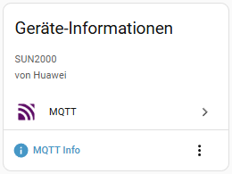

### Huawei Solar Modbus → Home Assistant via MQTT + Auto-Discovery

🇬🇧 **English** | [🇩🇪 Deutsch](README.de.md)

[](https://www.home-assistant.io/)
[](https://github.com/arboeh/huABus/releases/latest)
[](https://github.com/arboeh/huABus/actions)
[](https://codecov.io/gh/arboeh/huABus)
[](https://github.com/arboeh/huABus/graphs/commit-activity)
[](https://github.com/arboeh/huABus/blob/main/LICENSE)
[](https://github.com/arboeh/huABus)
[](https://github.com/arboeh/huABus)
[](https://github.com/arboeh/huABus)
[](https://github.com/arboeh/huABus)
[](https://github.com/arboeh/huABus)

> **⚠️ IMPORTANT: Single Modbus Connection Limit**
> Huawei inverters allow **only ONE active Modbus TCP connection**. This is a common beginner mistake.
>
> **Before installing:**
>
> - ✅ Remove any other Huawei Solar integrations (wlcrs/huawei_solar, HACS, etc.)
> - ✅ Disable monitoring tools and apps with Modbus access
> - ✅ Note: FusionSolar Cloud may show "Abnormal communication" - this is expected
>
> Multiple connections cause **timeouts and data loss**!

**58 Essential Registers, 69+ entities, ~2–5s cycle time**
**Changelog:** [CHANGELOG.md](huawei_solar_modbus_mqtt/CHANGELOG.md)

## Features

- **Modbus TCP → MQTT:** 69+ entities with Auto-Discovery
- **Complete Monitoring:** Battery, PV (1-4), Grid (3-phase), Energy counters
- **total_increasing Filter:** Prevents false counter resets in energy statistics
  - No warmup phase - immediate protection
  - Automatic reset on connection errors
  - Visible in logs with 20-cycle summaries
- **TRACE Log Level:** Ultra-detailed debugging with Modbus byte arrays
- **Comprehensive Test Suite:** 86% code coverage with unit, integration, and E2E tests
- **Performance:** ~2-5s cycle, configurable poll interval (30-60s recommended)
- **Error Tracking:** Intelligent aggregation with downtime tracking
- **MQTT Stability:** Connection wait loop and retry logic
- **Cross-Platform:** All major architectures (aarch64, amd64, armhf, armv7, i386)

## 🚀 Quick Start

**New to huABus?** Check our [5-minute Quick Start Guide](huawei_solar_modbus_mqtt/DOCS.md#-quick-start) for:

- ✅ Step-by-step installation with expected outputs
- ✅ Connection troubleshooting (Slave ID, timeouts)
- ✅ Clear success indicators
- ✅ Common first-time problems solved

Perfect for beginners! Experienced users: jump to [Configuration](#configuration).

## Comparison: wlcrs/huawei_solar vs. This Add-on

The `wlcrs/huawei_solar` is a **native Home Assistant integration**, while this is a **Home Assistant add-on**. Both use the same `huawei-solar` library but target different use cases:

| Feature                 | wlcrs/huawei_solar<br>(Integration) | This Add-on<br>(MQTT Bridge) |
| ----------------------- | ----------------------------------- | ---------------------------- |
| Installation            | Via HACS or manual                  | Via Add-on Store             |
| Battery control         | ✅                                  | ❌ (read-only)               |
| MQTT-native             | ❌                                  | ✅                           |
| total_increasing filter | ❌                                  | ✅                           |
| External integrations   | Limited                             | ✅ (EVCC, Node-RED, Grafana) |
| Cycle time              | Variable                            | 2-5s                         |
| Error tracking          | Basic                               | Advanced                     |
| Configuration           | UI or YAML                          | Add-on UI                    |

**Important:** Both share the same limitation - only **ONE Modbus connection**. To use both simultaneously, you need a Modbus Proxy.

**When to use which?**

- **wlcrs (Integration):** Battery control + native HA integration + direct entity access
- **This add-on (MQTT Bridge):** MQTT monitoring + external system integration + better error tracking

## Screenshots

### Home Assistant Integration


_Diagnostic entities showing inverter status, temperature, and battery information_


_Complete sensor overview with real-time power, energy, and grid data_


_MQTT device integration details_

## Installation

1. [](https://my.home-assistant.io/redirect/supervisor_add_addon_repository/?repository_url=https%3A%2F%2Fgithub.com%2Farboeh%2FhuABus)
2. Install "huABus | Huawei Solar Modbus to MQTT" → Start
3. **Settings → Devices & Services → MQTT → "Huawei Solar Inverter"**

## Configuration

Configure via Home Assistant UI with translated field names:

- **Modbus Host:** Inverter IP address (e.g. `192.168.1.100`)
- **Modbus Port:** Default: `502`
- **Slave ID:** Usually `1`, sometimes `16` or `0` (try different values on timeout)
- **MQTT Broker:** Default: `core-mosquitto`
- **MQTT Port:** Default: `1883`
- **MQTT Username/Password:** Optional (leave empty for auto-config)
- **MQTT Topic:** Default: `huawei-solar`
- **Log Level:** `TRACE` | `DEBUG` | `INFO` (recommended) | `WARNING` | `ERROR`
- **Status Timeout:** Default: `180s` (range: 30-600)
- **Poll Interval:** Default: `30s` (range: 10-300, recommended: 30-60s)

**Auto-MQTT:** Leave broker credentials empty → automatically uses HA MQTT Service

### MQTT Topics

- **Sensor Data (JSON):** `huawei-solar` (all sensors + timestamp)
- **Status (online/offline):** `huawei-solar/status` (availability topic + LWT)

### Example MQTT Payload

```json
{
  "power_active": 1609,
  "power_input": 2620,
  "battery_soc": 32,
  "battery_power": 1020,
  "meter_power_active": 50,
  "voltage_grid_A": 239.3,
  "inverter_temperature": 32.4,
  "inverter_status": "On-grid",
  "model_name": "SUN2000-6KTL-M1",
  "last_update": 1768649491
}
```

_Complete example: [examples/mqtt_payload.json](examples/mqtt_payload.json)_

## Important Entities

| Category    | Sensors                                                                                    |
| ----------- | ------------------------------------------------------------------------------------------ |
| **Power**   | `solar_power`, `input_power`, `grid_power`, `battery_power`, `pv1-4_power`                 |
| **Energy**  | `daily_yield`, `total_yield`\*, `grid_exported/imported`\*                                 |
| **Battery** | `battery_soc`, `charge/discharge_today`, `total_charge/discharge`\*, `bus_voltage/current` |
| **Grid**    | `voltage_phase_a/b/c`, `line_voltage_ab/bc/ca`, `frequency`                                |
| **Meter**   | `meter_power_phase_a/b/c`, `meter_current_a/b/c`, `meter_reactive_power`                   |
| **Device**  | `model_name`, `serial_number`, `efficiency`, `temperature`, `rated_power`                  |
| **Status**  | `inverter_status`, `battery_status`, `meter_status`                                        |

_\* Protected by total_increasing filter against false counter resets_

## Latest Updates

See [CHANGELOG.md](huawei_solar_modbus_mqtt/CHANGELOG.md) for detailed release notes.

**Recent highlights:**

- ✅ AppArmor security profile for container isolation
- ✅ Automatic requirements.txt generation from pyproject.toml
- ✅ Restart zero-drop fix (filter initialized before first cycle)
- ✅ 86% code coverage with comprehensive test suite
- ✅ Filter simplification (no warmup, no tolerance)
- ✅ TRACE log level for deep debugging
- ✅ Enhanced translations (EN/DE)

## Troubleshooting

### ⚠️ Multiple Modbus Connections (Most Common!)

**Symptom:** Timeouts, "No response received", intermittent data loss

**Solution:**

1. Check **Settings → Devices & Services** for other Huawei integrations
2. Remove official `wlcrs/huawei_solar` and HACS integrations
3. Disable third-party monitoring software
4. Note: FusionSolar Cloud "Abnormal communication" is normal

### Other Common Issues

| Issue                    | Solution                                                                   |
| ------------------------ | -------------------------------------------------------------------------- |
| **No Connection**        | Enable Modbus TCP, verify IP/Slave-ID (try 0/1/16), set `log_level: DEBUG` |
| **Connection Timeouts**  | Try different Slave IDs; increase poll_interval to 60s                     |
| **MQTT Errors**          | Set broker to `core-mosquitto`, leave credentials empty                    |
| **Performance Warnings** | Increase poll_interval if cycle time > 80% of interval                     |
| **Filter Activity**      | Occasional filtering (1-2/hour) is normal; frequent = connection issues    |

**Logs:** Add-ons → Huawei Solar Modbus to MQTT → Log Tab

## Support & Issues

Found a bug or have a feature request? Use our [GitHub Issue Templates](https://github.com/arboeh/huABus/issues/new/choose).

## Documentation

- 🇬🇧 **[DOCS.md](huawei_solar_modbus_mqtt/DOCS.md)** - Complete Documentation
- 🇩🇪 **[DOCS.de.md](huawei_solar_modbus_mqtt/DOCS.de.md)** - Vollständige Dokumentation

## Credits

**Based on:** [mjaschen/huawei-solar-modbus-to-mqtt](https://github.com/mjaschen/huawei-solar-modbus-to-mqtt)
**Uses library:** [wlcrs/huawei-solar-lib](https://github.com/wlcrs/huawei-solar-lib)
**Developed by:** [arboeh](https://github.com/arboeh) | **License:** MIT
